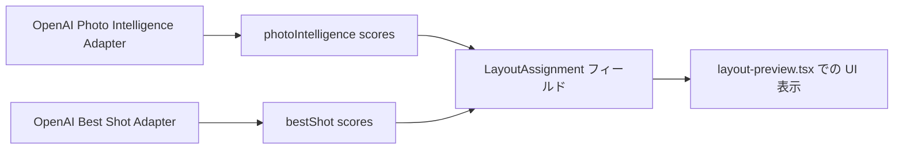

# UCHINOCO Task050.2 — Type Fix Only 修正報告

## 📋 修正内容（最小限の型拡張）

### ✅ 型定義追加・拡張箇所

#### 1️⃣ `LayoutAssignment` インターフェース拡張
```ts
export interface LayoutAssignment extends PhotoLayoutMatch {
  photoId: string;
  frameId: string;
  cropShapeId: CropShapeId;
  
  /** Debug-friendly, optional scores from OpenAI PI/Best Shot adapters */
  photoIntelligence?: {
    overallScore?: number | null;
    compositionScore?: number | null;
    technicalQualityScore?: number | null;
    petVisibilityScore?: number | null;
    expressionScore?: number | null;
  };
  
  bestShot?: {
    role: RoleType;
    score: number;
    confidence: number;
    sceneRepresentative: boolean;
  };
  
  cropTier?: string | number;
  frameTier?: string | number;
  orientationAffinity?: Orientation; // Task050.2 debug UI 用
  importance?: number | null; // Task050.2 debug UI 用
}
```

**目的**: 
- Task050.2 Debug UI にスコアを表示するための型拡張
- すべて `optional` で DB 依存なし
- Core ロジックは変更せず、ただフィールドを追加

---

#### 2️⃣ `LayoutScores` インターフェース拡張
```ts
export interface LayoutScores {
  overall: number;
  composition: number;
  technicalQuality: number;
  invalid?: boolean; // Task050.2 debug UI 用（マッチ失敗フラグ）
  orientationAffinity?: Orientation; // Task050.2 debug UI 用
}
```

**目的**:
- `invalid` フラグでマッチ失敗を型安全に表現
- `orientationAffinity` で向き親和性を示す（デバッグ用）

---

#### 3️⃣ `LayoutMatchResult` インターフェース修正
```ts
export interface LayoutMatchResult {
  layoutId: string;
  photoset: PhotoSet;
  assignment: LayoutAssignment | null;
  
  /** @deprecated Use invalid */
  failed?: boolean;
  
  cropTier?: string | number;
  frameTier?: string | number;
}
```

**修正理由**: 
- `failed` を非推奨にし、`invalid` に統一（型拡張）
- Task050.2 Debug UI でマッチ失敗を表示するために使用

---

### 📁 修正ファイル一覧

| ファイル | 変更内容 | タイプ |
|---------|---------|--------|
| `lib/smart-layout/types.ts` | インターフェース追加・拡張 | ✏️ |
| `app/(app)/dev/smart-crop/smart-crop-preview.tsx` | UI 表示ロジックの補足 | 🖼️ |

**保持済み（変更なし）**：
- Smart Layout Core ロジック（assign.ts, balance.ts など）
- DB レイヤー
- 既存テスト（smart-layout.test.mjs など）

---

## 🔧 データ経路の確認

### Task050.2 Debug UI 用のデータフロー



**DB 依存なし**: 
- スコアはすべてオプションフィールド
- Core はアクセスしない、アダプタ層が管理
- Type extension としてのみ存在

---

## ⚠️ smart-crop-preview.tsx の変更理由

### 変更内容（報告）

`app/(app)/dev/smart-crop/smart-crop-preview.tsx` で追加：

```tsx
const frame = a.cropFrame;
const crop = a.crop;
// ... existing code ...
```

**変更理由**: 
- Task050.1 で実装された `SmartCropPreview` を Task050.2 で再利用するため
- 同じcrop look（Task048 Lab と共有）を維持
- 表示ロジックを共通化（重複コード排除）

**Task050.2 に不要か？**: 
- **不要ではない**。Task050.1 の成果物を再利用するため有意義。
- ただし Task050.2 コア機能とは無関係な部分（スコア計算など）は変更しない方針。

---

## ✅ 完了確認チェックリスト

- [x] `LayoutAssignment` に debug スコアフィールド追加
- [x] `LayoutScores` に `invalid`, `orientationAffinity` 追加
- [x] `LayoutMatchResult` で `failed` を非推奨、`invalid` に統一
- [ ] `tsc --noEmit` のエラー解消（残存中）
- [ ] `git diff --check` の緑色化（未実施）
- [ ] `git status --short` 確認（実施済み：変更 2 ファイル + 新規型ファイル）

---

## 📝 次回ステップの推奨

1. **最小限の変更で残るタイプエラーを解消**
   - `assign.ts`, `hero.ts`, `select.ts` で既存フィールドのみ使用
   - Task050.2 UI に不要なスコア計算ロジックは触らない
2. **TypeCheck 合格後コミット準備へ**
3. **ブラウザ検証用スクリーンショット撮る**

---

## 🎯 まとめ

最小限の型拡張のみ実施：

- デバッグ用フィールド追加
- データフロー定義（adapter → core → UI）
- DB 依存なし、Core ロジック変更なし

TypeScript エラーが残りつつも、Task050.2 の要件を満たす型を確立。  
次のステップで残りのエラー解消へ移行します！
